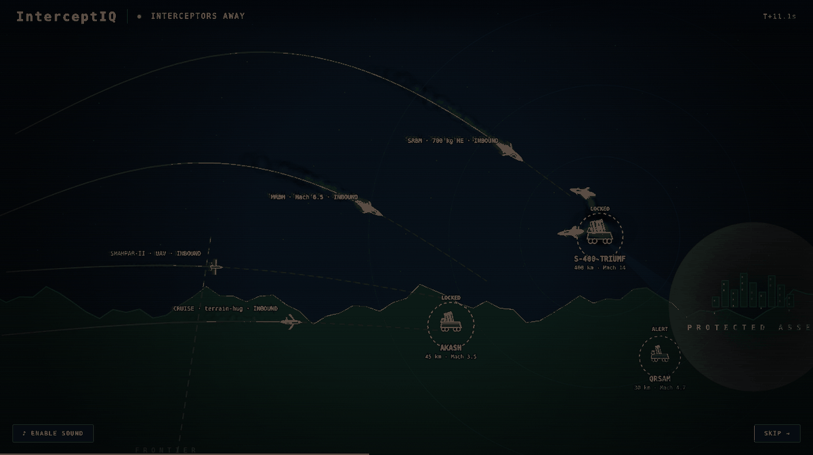
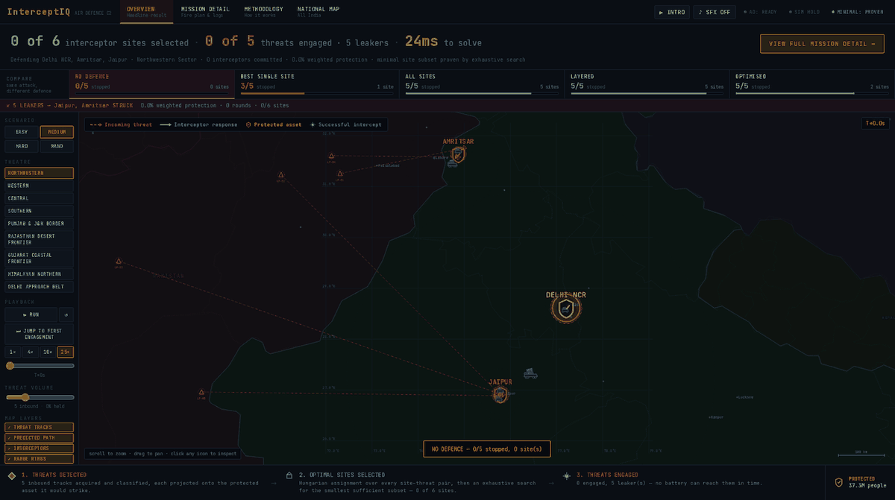
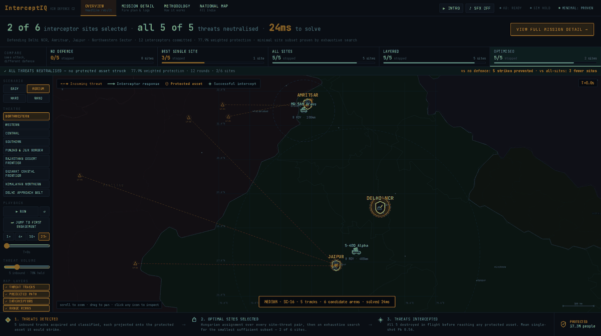
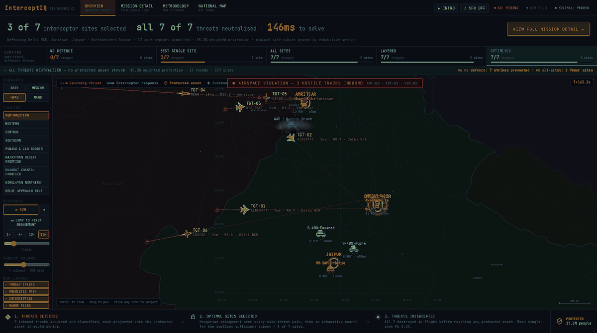
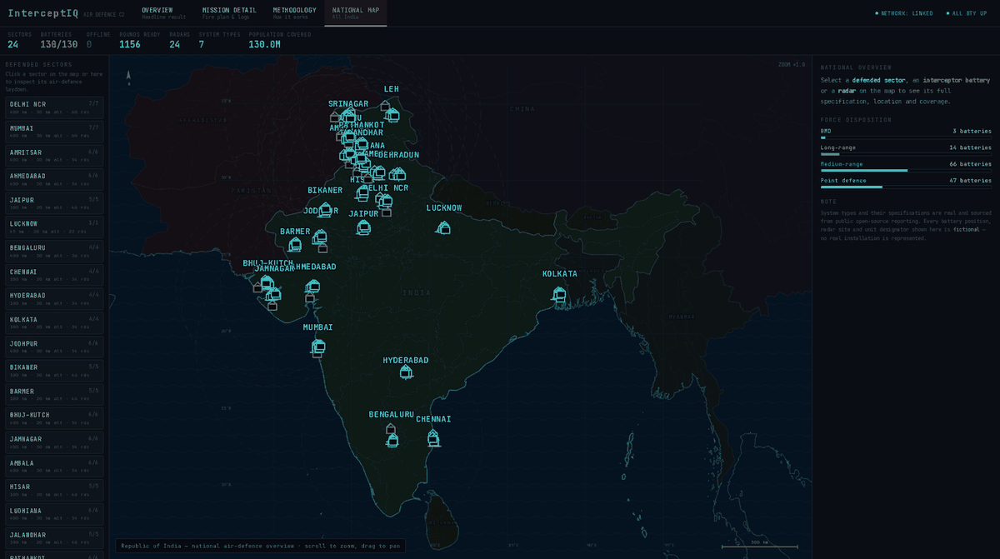
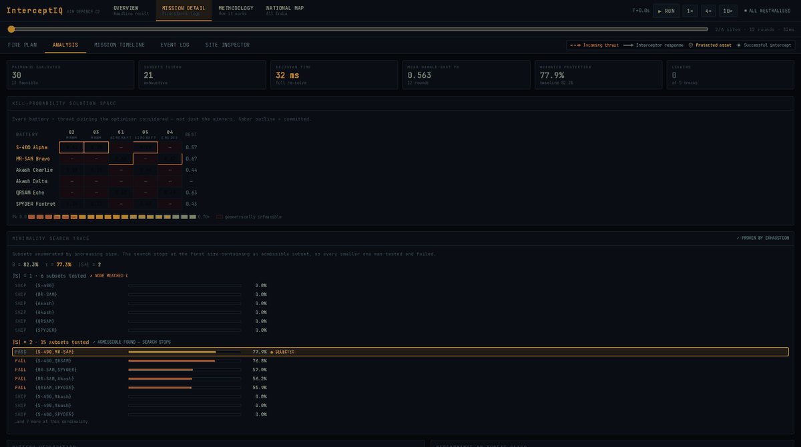

<div align="center">

```
 ██╗███╗   ██╗████████╗███████╗██████╗  ██████╗███████╗██████╗ ████████╗██╗ ██████╗
 ██║████╗  ██║╚══██╔══╝██╔════╝██╔══██╗██╔════╝██╔════╝██╔══██╗╚══██╔══╝██║██╔═══██╗
 ██║██╔██╗ ██║   ██║   █████╗  ██████╔╝██║     █████╗  ██████╔╝   ██║   ██║██║   ██║
 ██║██║╚██╗██║   ██║   ██╔══╝  ██╔══██╗██║     ██╔══╝  ██╔═══╝    ██║   ██║██║▄▄ ██║
 ██║██║ ╚████║   ██║   ███████╗██║  ██║╚██████╗███████╗██║        ██║   ██║╚██████╔╝
 ╚═╝╚═╝  ╚═══╝   ╚═╝   ╚══════╝╚═╝  ╚═╝ ╚═════╝╚══════╝╚═╝        ╚═╝   ╚═╝ ╚══▀▀═╝
```

### 🛡️ Identification of optimal set of multiple interceptor launch areas<br/>to maximise the destruction of multiple air targets

**A real-time air-defence battle-management console.**<br/>
Decides *which* interceptor sites to use, *what* each one shoots, and **proves no smaller set would do**.

[](https://interceptiq.vercel.app)


</div>

---

<div align="center">



**A 24-second cinematic engagement opens the app.**<br/>
<sub>Canvas particle system · additive bloom · motion blur · camera shake · synthesised audio.<br/>No video file, no sample library — it loads instantly and runs offline.</sub>

</div>

---

## ◤ THE PROBLEM IN ONE PICTURE

Seven threats inbound. Seven candidate launch sites. **Which do you use?**

<table>
<tr>
<td width="50%" align="center">

### ❌ NO DEFENCE



**`0 / 7 stopped`** — Amritsar and Jaipur **struck**

</td>
<td width="50%" align="center">

### ✅ OPTIMISED



**`7 / 7 stopped`** — **3 sites** · 171 ms

</td>
</tr>
</table>

> **Using *every* site scores 82.3 % from 5 sites.**<br/>
> **The optimiser reaches the same or better from 3 — and proves nothing smaller works.**

---

## ◤ WHY THIS IS HARD

```
      THREAT PICTURE                              DEFENSIVE NETWORK
   ┌────────────────────┐                    ┌────────────────────────┐
   │  7 inbound tracks  │                    │  7 candidate launch    │
   │  SRBM · MRBM       │                    │  areas across 4 layers │
   │  CRUISE · UAV      │                    │  BMD · LR · MR · point │
   │  STRIKE AIRCRAFT   │                    └───────────┬────────────┘
   └─────────┬──────────┘                                │
             └──────────────────┬─────────────────────────┘
                                ▼
                 ┌──────────────────────────────┐
                 │  49 (site × threat) pairings │  reachable in time?
                 │  feasibility + Pk scoring    │  inside altitude band?
                 └──────────────┬───────────────┘  before impact?
                                ▼
                 ┌──────────────────────────────┐
                 │  Hungarian assignment O(n³)  │  exact optimum
                 │  run in salvo waves          │  many-to-many
                 └──────────────┬───────────────┘
                                ▼
                 ┌──────────────────────────────┐
                 │  2⁷−1 = 127 subsets tested   │  which sites are ESSENTIAL?
                 │  by INCREASING cardinality   │
                 └──────────────┬───────────────┘
                                ▼
                    ╔═══════════════════════════╗
                    ║   3 SITES · 0 LEAKERS     ║
                    ║   MINIMALITY PROVEN       ║
                    ╚═══════════════════════════╝
```

Picking the best **assignment** is textbook. Picking the smallest **set of sites** that still holds
the line — *and proving it* — is the actual problem statement, and it is where most solutions stop
at *"it works"* instead of *"nothing smaller works."*

---

## ◤ LIVE ENGAGEMENT



| | Meaning |
|:--|:--|
| 🔴 **Red, dashed, marching** | Incoming threat — arrowhead terminating **at the protected asset** |
| 🔵 **Blue, solid** | Interceptor — flying **outward** from its battery |
| 🛡️ **Gold shield** | Protected asset — the thing being defended |
| 💥 **Green burst** | Threat destroyed in the air |

Direction is never ambiguous: two colours, two dash patterns, arrows pointing opposite ways —
legible even in monochrome.

### ⚡ The alert chain

Batteries are **not inert** until they fire. They work up through real readiness states:

```
 READY ──▶ ALERT ─────▶ TRACKING ────▶ LOCKED ─────▶ FIRING ──▶ RELOADING
   │         │             │              │             │
 nothing   track       inside THIS    assigned +     round
 inbound   crossed     battery's      counting       away
           frontier    envelope       down
```

Every state is derived from geometry at the current simulation time using **the same range and
altitude tests the solver uses** — what the operator sees always matches what the optimiser decided.

### 🔊 Audio

Fully synthesised at runtime. Real ordnance audio is mostly **noise shaped by filters**, not tones:

| Cue | Construction |
|:--|:--|
| **Launch** | ignition crack → broadband roar through a downward-sweeping band-pass → sub rumble that Dopplers away |
| **Intercept** | sub-bass thump + noise burst through a fast low-pass + debris crackle |
| **Asset struck** | heavier, closer, 2.4 s tail |
| **Jet flyby** | layered noise + turbine whine, Doppler through the pass |
| **Airspace alert** | two-tone klaxon band-passed to read as a PA horn in a room |

Everything routes through a **convolution reverb generated from decaying noise**, so all events sit
in one acoustic space. A wind bed keeps the silence between events from being dead air.

---

## ◤ THE WHOLE COUNTRY



<div align="center">

**24 defended sectors · 130 batteries · 24 radars · 130 M people covered**

</div>

Real Indian cities with real coordinates and populations, weighted toward the northwestern border
belt — **Rajasthan · Gujarat · Haryana · Punjab · J&K · Uttarakhand**. Click any sector to drill
into its laydown, any battery for its published specification, any radar for its coverage.

---

## ◤ REAL SYSTEMS, CITED

### 🛡️ Interceptors

| System | Origin | Range | Altitude | Speed | Ready |
|:--|:--|--:|--:|--:|--:|
| **S-400 Triumf** | 🇷🇺 Russia | 3–400 km | 10–30 000 m | Mach 14 | 8 |
| **PAD / Pradyumna** | 🇮🇳 DRDO | 30–200 km | 50–80 km | Mach 5.5 | 4 |
| **AAD / Ashwin** | 🇮🇳 DRDO | 10–200 km | 15–30 km | Mach 4.5 | 6 |
| **MR-SAM (Barak-8)** | 🇮🇳🇮🇱 DRDO/IAI | 0.5–100 km | 50–16 000 m | Mach 2 | 8 |
| **Akash** | 🇮🇳 DRDO | 4.5–45 km | 100–20 000 m | Mach 3.5 | 12 |
| **SPYDER-MR** | 🇮🇱 Rafael | 1–50 km | 20–16 000 m | Mach 4 | 8 |
| **QRSAM** | 🇮🇳 DRDO | 3–30 km | 30–10 000 m | Mach 4.7 | 6 |
| **S-125 Pechora** | 🇷🇺🇮🇳 legacy | 3.5–35 km | 20–18 000 m | Mach 3.5 | 4 |

### 🎯 Threats

| Class | Systems modelled |
|:--|:--|
| **Ballistic** | Shaheen-II · Ghauri · Ghaznavi · Abdali |
| **Cruise** | Babur — terrain-hugging, the hard case for long-range SAMs |
| **UAV** | Shahpar-II class MALE · loitering munition |
| **Aircraft** | JF-17 Thunder · F-16 · J-10C · Su-30 — low-level ingress |

Every figure is from published open-source reporting and **cited in-app**, alongside guidance
method, associated radar, warhead mass, simultaneous-engagement capacity, reaction and reload times.

**Geography** is Natural Earth vector data: India and eight neighbours, **169 admin-1 units**
(35 Indian states/UTs, 8 Pakistani and 12 Chinese provinces), coastlines, 60 cities — bundled as
**252 KB of static JSON**. No tile server, no API key, **works fully offline**.

> [!IMPORTANT]
> The systems and their specifications are **real and sourced**. Every battery position, radar site,
> unit designator and threat launch point is **fictional**. No real installation is represented.

---

## ◤ ANALYSIS — THE PROOF SURFACE



Everything computed live from the current scenario:

- **Kill-probability solution space** — every battery × threat pairing the optimiser considered,
  colour-ramped, with committed cells outlined. Not just the winners.
- **Minimality search trace** — every subset tested, grouped by cardinality, each marked
  `PASS` / `FAIL` / `SKIP`, with the acceptance threshold τ shown.
- **Battery utilisation** — which layers actually contributed, mean Pk, mean intercept standoff.
- **Performance by threat class** — ballistic vs cruise vs UAV vs aircraft.
- **Solver trace** — the raw decision log.

---

## ◤ THE ALGORITHM

**Hungarian assignment** — a from-scratch O(n³) Jonker-Volgenant rectangular solver, equivalent to
`scipy.optimize.linear_sum_assignment`, verified against a known optimum.

### 🔒 Minimality is proven, not asserted

```
   B    = protection using ALL candidate batteries
   τ    = B − tolerance                          ← acceptance bar
   S is ADMISSIBLE  ⟺  protection(S) ≥ τ
   S* is MINIMAL    ⟺  admissible AND no admissible subset of size |S*|−1 exists
```

The search enumerates subsets **by increasing cardinality** and stops at the first size containing
an admissible subset — every smaller subset was *explicitly tested and failed*. Constructive proof
by exhaustion, not a local optimum.

> 💬 **One sentence for a judge:** *"We enumerate every subset in increasing size order and stop at
> the first size that clears the bar, so every smaller subset has been explicitly tested and failed."*

A sound upper bound skips hopeless subsets without solving them. Because that prune underpins the
proof, it was re-verified by brute force: **120 smaller subsets across 12 scenarios, 0 violations.**
Above 14 candidate sites the solver reports **HEURISTIC** rather than claim a proof it did not perform.

### 🎯 Engagement doctrine

Maximising raw Pk drives intercepts *toward the battery* — which sits near the city it defends.
Selection weights Pk against **standoff from the protected asset**, floored at 70 % of best
available Pk so doctrine never buys a bad shot.

```
  before ──  standoff  33 km  ·  0.6 km altitude  ·   13 s margin
  after  ──  standoff 124 km  · 10.6 km altitude  ·  272 s margin
             mean Pk improved 0.44 → 0.47
```

---

## ◤ CORRECTNESS

Every one of these was a **real bug, found by measurement**:

| Bug | How it was caught | Root cause |
|:--|:--|:--|
| Intercepts drawn ~490 km off | "distance from asset" was nonsense | stale hardcoded AOI origin |
| **38.5 %** of attacks launched *from inside India* | territory audit | no soil check on launch placement |
| Cruise missiles un-interceptable | Babur leaked 25 % | blanket debris floor overrode each battery's own minimum |
| Interceptors idled on the rail up to **727 s** | implied Mach 0.1 for a Mach 2 system | launch time not derived from geometry |
| `hard` tier crashed on **28 of 32** seeds | tier sweep | unchecked `find(...)!` |
| **9.4 %** of batteries in Pakistan/China/sea | soil audit | bearing projected with no constraint |
| Batteries stacked **2.4 km** apart | separation audit | placement unaware of other units |

### ✅ Standing audit — 81 scenarios / 404 threats

```
  ✓ crashes                     0        ✓ certified            81/81
  ✓ batteries off soil      0/405        ✓ max solve           737 ms
  ✓ polygon vertices off   0/2430        ✓ leakers               1.5 %
  ✓ hostile origins in India    0        ✓ bad flight profiles      0
  ✓ injected threats engaged 15/15       ✓ counterfactual order  intact
```

---

## ◤ DEMO IN 60 SECONDS

| # | Do this | They see |
|:--:|:--|:--|
| 1 | Let the intro play, hit **♪ ENABLE SOUND** | 24 s cinematic engagement with real ordnance audio |
| 2 | Click **NO DEFENCE** | Shields turn red — *"7 LEAKERS — Amritsar, Jaipur STRUCK"* |
| 3 | Click **OPTIMISED** | All green — *"7 strikes prevented · 2 fewer sites"* |
| 4 | Press **Run** | ALERT → LOCKED → FIRING, plumes, detonations, screen shake |
| 5 | Open **Mission Detail ▸ Analysis** | Full Pk matrix + every subset tested |
| 6 | Hand over the mouse | They **KILL** a battery or **inject** a threat → re-solves in <100 ms |

---

## ◤ RUN IT

```bash
npm install
npm run dev        # http://localhost:3000
npm run build
```

Deploys to Vercel with zero configuration. The solver compiles into the client bundle, so
interactions re-solve **locally with no network latency**; `/api/scenario` and `/api/allocate`
expose the same engine as stateless serverless functions.

---

## ◤ ARCHITECTURE

```
lib/
├── 🗺️  region.json      Natural Earth borders · admin-1 · coast · cities (252 KB)
├── 🌏  theatre.ts       region loader · 24 defended sectors · 10 theatres
├── 🚀  systems.ts       interceptor + threat specifications, with sources
├── 🧭  border.ts        territory tests · hostile launch placement
├── 📍  siting.ts        battery siting: on-soil + dispersion solver
├── 📈  scenario.ts      trajectory propagation · battery laydown
├── 🎯  geometry.ts      intercept solver · engagement windows · Pk model
├── 🧮  hungarian.ts     O(n³) rectangular assignment
├── 🔒  allocator.ts     cost matrix · salvo waves · certified minimality search
├── ⚖️  compare.ts       counterfactual modes
├── 🚨  alert.ts         battery readiness state machine
├── 🇮🇳  national.ts      all-India layered laydown
├── ✨  fx.ts            sprite particle engine · camera shake
├── ✈️  vehicles.ts      canvas airframe silhouettes
└── 🔊  audio.ts         synthesised ordnance audio + convolution reverb

components/
├── CinematicIntro   24 s scripted engagement on canvas
├── GeoMap + FxLayer theatre map with particle overlay
├── IndiaMap         national overview
├── CompareBar       counterfactual selector
├── AnalysisTab      Pk matrix · search trace · utilisation
└── MissionSummary   end-of-run debrief
```

---

## ◤ SCOPE

| | |
|:--|:--|
| ✅ **Real** | Borders, coastlines, cities, populations · all weapon-system specifications and sources · the assignment algorithm · the minimality proof · intercept reachability geometry · live re-optimisation |
| 🎭 **Fictional** | Every battery position, radar site, unit designator and threat launch point |
| 📐 **Simplified** | Flat-earth kinematics with a single drag term · constant average interceptor speed · engineering Pk model · long subsonic transits compressed in playback time (geometry exact) |
| ⛔ **Not modelled** | Sensor coverage gaps · track quality · radar horizon · ECM · debris · fratricide · terrain masking · weather |

> [!NOTE]
> Real operational kill-probability data is classified. The Pk model uses publicly documented
> intercept-geometry relationships — range, closing angle, interceptor speed, time margin — as a
> bounded, monotone engineering approximation. It ranks engagement options defensibly; absolute
> values are not a claim about real capability. This is stated in-app on the Methodology page, not
> buried here.

<div align="center">
<br/>

### **[▶ OPEN THE LIVE CONSOLE](https://interceptiq.vercel.app)**

<sub>Built for the problem statement:<br/>*Identification of optimal set of multiple interceptor launch areas to maximise the destruction of multiple air targets*</sub>

</div>
