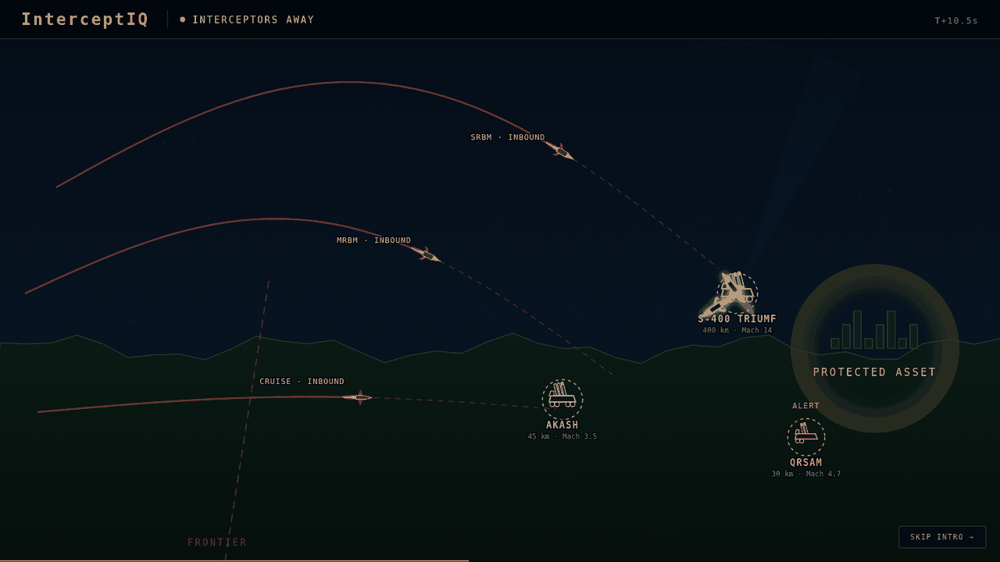

<div align="center">

```
 ██╗███╗   ██╗████████╗███████╗██████╗  ██████╗███████╗██████╗ ████████╗██╗ ██████╗
 ██║████╗  ██║╚══██╔══╝██╔════╝██╔══██╗██╔════╝██╔════╝██╔══██╗╚══██╔══╝██║██╔═══██╗
 ██║██╔██╗ ██║   ██║   █████╗  ██████╔╝██║     █████╗  ██████╔╝   ██║   ██║██║   ██║
 ██║██║╚██╗██║   ██║   ██╔══╝  ██╔══██╗██║     ██╔══╝  ██╔═══╝    ██║   ██║██║▄▄ ██║
 ██║██║ ╚████║   ██║   ███████╗██║  ██║╚██████╗███████╗██║        ██║   ██║╚██████╔╝
 ╚═╝╚═╝  ╚═══╝   ╚═╝   ╚══════╝╚═╝  ╚═╝ ╚═════╝╚══════╝╚═╝        ╚═╝   ╚═╝ ╚══▀▀═╝
```

### Identification of optimal set of multiple interceptor launch areas<br/>to maximise the destruction of multiple air targets

**A real-time air-defence battle-management console.**<br/>
Decides *which* interceptor sites to use, *what* each one shoots, and *proves* no smaller set would do.

[](https://interceptiq.vercel.app)


</div>

---

<div align="center">



<sub>*The cinematic intro — S-400, Akash and QRSAM engaging a layered attack. Rendered live in SVG, no video file.*</sub>

</div>

---

## ◢ The problem in one picture

Five missiles are inbound. You have six candidate launch sites. **Which do you use?**

<table>
<tr>
<td width="50%" align="center">

**NO DEFENCE**


`0 / 5 stopped` · Amritsar and Jaipur **struck**

</td>
<td width="50%" align="center">

**OPTIMISED**


`5 / 5 stopped` · **3 sites** · 63 ms

</td>
</tr>
</table>

> Using **every** site gets 74.5 % protection from 5 sites.<br/>
> The optimiser gets **the same or better from 3** — and proves nothing smaller works.

---

## ◢ Why this is hard

```
        THREAT                                    DEFENCE
   ┌──────────────┐                          ┌──────────────┐
   │  5 inbound   │                          │  6 candidate │
   │  tracks      │                          │  launch sites│
   └──────┬───────┘                          └──────┬───────┘
          │                                         │
          │        every pairing must be tested     │
          └────────────────┬────────────────────────┘
                           ▼
              ┌─────────────────────────┐
              │  30 (site × threat)     │   can it reach in time?
              │  feasibility checks     │   inside altitude band?
              └───────────┬─────────────┘   before impact?
                          ▼
              ┌─────────────────────────┐
              │  Hungarian assignment   │   O(n³) exact optimum
              └───────────┬─────────────┘
                          ▼
              ┌─────────────────────────┐
              │  2⁶ − 1 = 63 subsets    │   which sites are ESSENTIAL?
              │  tested by cardinality  │
              └───────────┬─────────────┘
                          ▼
                 ╔═════════════════════╗
                 ║  3 sites · PROVEN   ║
                 ║  minimal · 0 leakers║
                 ╚═════════════════════╝
```

Picking the best *assignment* is textbook. Picking the smallest *set of sites* that still holds
the line — and proving it — is the actual problem statement, and it is where most solutions stop
at "it works" instead of "nothing smaller works."

---

## ◢ Live engagement


<table>
<tr><td width="120"><b>🔴 Red</b></td><td>Incoming threat — dashed, marching, arrowhead terminating <b>at the protected asset</b></td></tr>
<tr><td><b>🔵 Blue</b></td><td>Interceptor — solid, flying <b>outward</b> from its battery</td></tr>
<tr><td><b>🛡️ Gold</b></td><td>Protected asset — the thing being defended</td></tr>
<tr><td><b>💥 Green</b></td><td>Threat destroyed in the air</td></tr>
</table>

Direction is never ambiguous. Two line types, two colours, two dash patterns, arrows pointing
opposite ways — legible even in monochrome.

### The alert chain

Batteries are not inert until they fire. They work up through real readiness states:

```
  READY ──▶ ALERT ──────▶ TRACKING ─────▶ LOCKED ──────▶ FIRING ──▶ RELOADING
    │         │              │               │              │
  nothing   track       inside THIS      assigned +     round away
  inbound   crossed     battery's        counting
            frontier    envelope         down
```

Every state is derived from geometry at the current simulation time, using **the same
range and altitude tests the solver uses** — so what the operator sees always matches what the
optimiser decided.

---

## ◢ The whole country


**24 defended sectors · 130 batteries · 24 radars · 130 M people covered**

Real Indian cities with real coordinates and populations, weighted toward the northwestern border
belt — Rajasthan, Gujarat, Haryana, Punjab, J&K, Uttarakhand. Click any sector to drill into its
laydown, any battery for its full published specification, any radar for its coverage.

---

## ◢ Real data, cited

<table>
<tr><th align="left">System</th><th>Origin</th><th>Range</th><th>Altitude</th><th>Speed</th><th>Ready</th></tr>
<tr><td><b>S-400 Triumf</b></td><td>Russia</td><td>3–400 km</td><td>10–30 000 m</td><td>Mach 14</td><td>8</td></tr>
<tr><td><b>PAD / Pradyumna</b></td><td>India (DRDO)</td><td>30–200 km</td><td>50–80 km</td><td>Mach 5.5</td><td>4</td></tr>
<tr><td><b>AAD / Ashwin</b></td><td>India (DRDO)</td><td>10–200 km</td><td>15–30 km</td><td>Mach 4.5</td><td>6</td></tr>
<tr><td><b>MR-SAM (Barak-8)</b></td><td>India–Israel</td><td>0.5–100 km</td><td>50–16 000 m</td><td>Mach 2</td><td>8</td></tr>
<tr><td><b>Akash</b></td><td>India (DRDO)</td><td>4.5–45 km</td><td>100–20 000 m</td><td>Mach 3.5</td><td>12</td></tr>
<tr><td><b>SPYDER-MR</b></td><td>Israel (Rafael)</td><td>1–50 km</td><td>20–16 000 m</td><td>Mach 4</td><td>8</td></tr>
<tr><td><b>QRSAM</b></td><td>India (DRDO)</td><td>3–30 km</td><td>30–10 000 m</td><td>Mach 4.7</td><td>6</td></tr>
<tr><td><b>S-125 Pechora</b></td><td>USSR / India</td><td>3.5–35 km</td><td>20–18 000 m</td><td>Mach 3.5</td><td>4</td></tr>
</table>

Every figure is from published open-source reporting and **cited in-app**, alongside guidance
method, associated radar, warhead mass, simultaneous-engagement capacity, reaction and reload
times. Threats are modelled the same way — Shaheen-II, Ghauri, Ghaznavi, Abdali, Babur, plus a
Shahpar-II class UAV and a loitering munition.

**Geography** is Natural Earth vector data: India and eight neighbours, 169 admin-1 units
(35 Indian states/UTs, 8 Pakistani and 12 Chinese provinces), coastlines, 60 cities — simplified
and bundled as **252 KB of static JSON**. No tile server, no API key, **works fully offline**.

> [!IMPORTANT]
> The systems and their specifications are **real and sourced**. Every battery position, radar
> site, unit designator and threat launch point is **fictional**. No real installation is
> represented.

---

## ◢ The algorithm


**Hungarian assignment** — a from-scratch O(n³) Jonker-Volgenant rectangular solver, equivalent to
`scipy.optimize.linear_sum_assignment`, verified against a known optimum. Rows are interceptor
rounds, columns are live threats, cost is `−(Pk × target value)`.

### Minimality is proven, not asserted

```
   B    = protection using ALL candidate batteries
   τ    = B − tolerance                          ← the acceptance bar
   S is ADMISSIBLE  ⟺  protection(S) ≥ τ
   S* is MINIMAL    ⟺  admissible AND no admissible subset of size |S*|−1 exists
```

The search enumerates subsets **by increasing cardinality** and stops at the first size containing
an admissible subset — so every smaller subset was *explicitly tested and failed*. That is a
constructive proof by exhaustion, not a local optimum.

> **One sentence for a judge:** *"We enumerate every subset in increasing size order and stop at
> the first size that clears the bar, so every smaller subset has been explicitly tested and
> failed."*

A sound upper bound skips hopeless subsets without solving them. Because that prune underpins the
proof, it was re-verified by brute force: **120 smaller subsets across 12 scenarios, 0 violations.**
Above 14 candidate sites the solver reports **HEURISTIC** rather than claim a proof it did not
perform.

### Engagement doctrine

Maximising raw Pk drives intercepts *toward the battery* — which sits near the city it defends.
Selection weights Pk against **standoff from the protected asset**, floored at 70 % of best
available Pk so doctrine never buys a bad shot.

```
  before ──  mean intercept standoff  33 km   ·  0.6 km altitude  ·  13 s margin
  after  ──  mean intercept standoff 124 km   ·  10.6 km altitude ·  272 s margin
             mean Pk improved 0.44 → 0.47
```

---

## ◢ Correctness

Every one of these was a real bug, found by measurement:

| Bug | How it was caught | Root cause |
|---|---|---|
| Intercepts drawn ~490 km off | "distance from asset" was nonsense | solver used a stale hardcoded AOI origin |
| **38.5 %** of attacks launched *from inside India* | territory audit | no soil check on launch placement |
| Cruise missiles un-interceptable | Babur leaked 25 % | a blanket debris floor overrode each battery's own minimum altitude |
| Interceptors idled on the rail up to **727 s** | implied Mach 0.1 for a Mach 2 system | launch time not derived from geometry |
| `hard` tier crashed on **28 of 32** seeds | tier sweep | unchecked `find(...)!` returning undefined |
| **9.4 %** of batteries sited in Pakistan/China/sea | soil audit | bearing projected with no constraint |
| Batteries stacked **2.4 km** apart | separation audit | placement had no awareness of other units |

### Standing audit — 81 scenarios / 393 threats, every theatre and tier

```
  ✓ crashes                     0        ✓ certified            81/81
  ✓ batteries off soil      0/405        ✓ max solve           625 ms
  ✓ polygon vertices off   0/2430        ✓ leakers               1.5 %
  ✓ hostile origins in India    0        ✓ bad flight profiles      0
  ✓ injected threats engaged 15/15       ✓ counterfactual order  intact
```

---

## ◢ Run it

```bash
npm install
npm run dev        # http://localhost:3000
npm run build
```

Deploys to Vercel with zero configuration. The solver compiles into the client bundle, so
interactions re-solve **locally with no network latency**; `/api/scenario` and `/api/allocate`
expose the same engine as stateless serverless functions.

### Demo in 60 seconds

| # | Do this | They see |
|---|---|---|
| 1 | Let the intro play | 22 s cinematic engagement, real systems |
| 2 | Click **NO DEFENCE** | Shields turn red — *"5 LEAKERS — Amritsar, Jaipur STRUCK"* |
| 3 | Click **OPTIMISED** | All green — *"5 strikes prevented · 2 fewer sites"* |
| 4 | Press **Run** | Batteries ALERT → LOCKED → FIRING, interceptors fly, bursts |
| 5 | Hand over the mouse | They **KILL** a battery or **inject** a threat → re-solves in <100 ms |

---

## ◢ Layout

```
lib/
├── region.json      Natural Earth borders, admin-1 units, coast, cities  (252 KB)
├── theatre.ts       region loader · 24 defended sectors · 10 theatres
├── systems.ts       interceptor + threat specifications, with sources
├── border.ts        territory tests · hostile launch placement
├── siting.ts        battery siting: on-soil + dispersion solver
├── scenario.ts      trajectory propagation · battery laydown
├── geometry.ts      intercept solver · engagement windows · Pk model
├── hungarian.ts     O(n³) rectangular assignment
├── allocator.ts     cost matrix · salvo waves · certified minimality search
├── compare.ts       counterfactual modes
├── alert.ts         battery readiness state machine
├── national.ts      all-India layered laydown
└── audio.ts         synthesised launch / intercept / impact cues

components/
├── CinematicIntro   22 s scripted engagement, pure SVG
├── GeoMap           theatre map · pan · zoom · live tracks
├── IndiaMap         national overview
├── CompareBar       counterfactual selector
├── Inspector        entity detail
└── MissionSummary   end-of-run debrief
```

---

## ◢ Scope

| | |
|---|---|
| **Real** | Borders, coastlines, cities, populations · all weapon-system specifications and sources · the assignment algorithm · the minimality proof · intercept reachability geometry · live re-optimisation |
| **Fictional** | Every battery position, radar site, unit designator and threat launch point |
| **Simplified** | Flat-earth kinematics with a single drag term · constant average interceptor speed · engineering Pk model · long subsonic transits compressed in playback time (geometry exact) |
| **Not modelled** | Sensor coverage gaps · track quality · radar horizon · ECM · debris · fratricide · terrain masking · weather |

> [!NOTE]
> Real operational kill-probability data is classified. The Pk model uses publicly documented
> intercept-geometry relationships — range, closing angle, interceptor speed, time margin — as a
> bounded, monotone engineering approximation. It ranks engagement options defensibly; absolute
> values are not a claim about real capability. This is stated in-app on the Methodology page, not
> buried here.

<div align="center">
<br/>

**[▶ Open the live console](https://interceptiq.vercel.app)**

</div>
